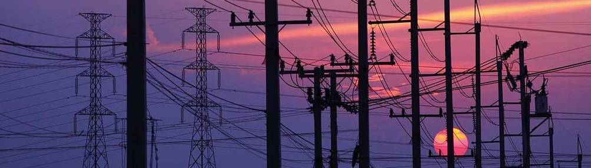

# Shelly Green Grid Guardian

The electric power network has faced significant challenges in the past two decades, primarily due to the extensive integration of dispersed power sources, heat pumps, and electric vehicles. Operators of distribution systems throughout the EU are grappling with the issue of network overloading as a result. 

Electricity customers are increasingly facing higher electricity prices and delivery restrictions. In the past, lower grid fees were a reward for using electricity at night. Now, rewards have been replaced by penalties if you exceed the agreed 15-minute power limit. 

The solutions described here represent one possible way to address this issue. The primary objectives of the Shelly Green Grid Guardian project are focused on redistributing domestic electricity consumption to avoid unnecessary overloads in demand and reduce unnecessary energy consumption. The solution is comprised of several independent and distributed components, each contributing a small part towards achieving the ultimate goal.

Detailed descriptions of the **Shelly Green Grid Guardian project** can be found in the following documents:

* [Temporary Powering Down of Loads to Prevent Overload](load-shedding.md)
* [Control and Monitoring of the Bathroom Heater](wallHeater.md)
* [Visual Indication of Energy Consumption](consumption-indication.md)
* [Frost Guard Shield](frost-guard-shield.md)

and all the necessary source code files are included.

During the development of an application, it is necessary to frequently simulate the variable power of network. Here is a description of the testing tool that I personally use: 
* [load simulator for Shelly EM](load-simulator.md)

