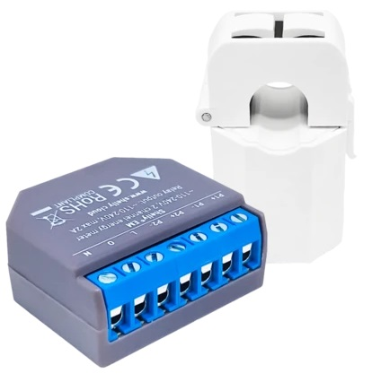

# Visual Indication of Energy Consumption

Visual indication of electricity consumption allows household members to easily see the current state of the network. Users can adjust the use of electrical appliances based on this indication.

For this purpose, the **Shelly Plus PlugS** is used because it has programmable LED indication. Two modes are envisaged for this LED indication:

- one based on current power load and
- the other on 15-minute energy consumption.

## Configuration

Configuration design is based on following Shelly devices:

| Device view | Description |
|:---:|:---|
| |**Shelly EM** is designed for measuring electrical energy. Must be installed in the main distribution panel on the supply line from the distribution. The installation is simple, as the device features a current transformer that clamps onto the supply conductor. My system is single-phase, if you have a three-phase system you need to use another device and software needs to be slightly modified.|
| |**Shelly Plus Plug S** featuring a front-facing color LED indication, allows us to signalize the status in the electrical network. It can be plugged into any socket in a location where it is clearly visible.|

##	Description

**Shelly EM** is Gen 1 device so no software is foreseen in this device. Nevertheless, you can retrieve real-time power consumption and energy usage data from this device. When installing the Shelly EM device, it is important to set a fixed IP address. This ensures that other devices can always locate it and access its data when needed.

The LED indicators on the **Shelly Plus Plug S** operate exclusively based on the consumption status from the Shelly EM. The power meter on the Shelly Plus Plug S itself is not used. It is also not necessary for any device to be connected to the Shelly Plus Plug S. The Shelly Plus Plug S is used exclusively as an optical indicator of the network status.

On the **Shelly Plus Plug S** device, install the software located in the file: `consumption-indication.js`

[More detailed instructions how to install the software can be found on the manufacturer's website.](https://shelly-api-docs.shelly.cloud/gen2/Scripts/Tutorial)

The optical indication on the Shelly Plus Plug S operates in two modes: 

- When the **device relay is OFF** (mode off): in this mode, the LED indication is updated every 10 seconds with a color representing the current power load (see picture below).

- The second mode is when the **device relay is ON** (mode on); here, we display the energy consumption state over a 15-minute period updated every full minute. In this mode, the color represents the consumption state, and the flashing speed indicates approximately where we are within the 15-minute interval. At the beginning of the 15-minute period, the flashing is slower, and towards the end of the period, it becomes progressively faster (see picture below).

Signaling in "mode on" must be indicated with precise timing. It's not about any 15-minute interval but rather specific intervals within each hour. To synchronize with real time clock, we use addStatusHandler, which updates the energy data "aenergy" every full minute. We extract the hour information from getComponentStatus("sys"), and from the minutes, we derive 15-minute intervals.

The consumption of electrical energy is updated every minute. Because energy is time-dependent, it is necessary to recalculate the limits that determine the color of the LED display every minute as well.

The meaning of colors is generally in both mode as follows: 
- green lights up below the "low" limit, 
- yellow lights up between the "low" and "medium" limit, 
- red lights up between the "medium" and "high" limit, 
- blue lights up above the "high" limit, and 
- white lights up when the data for display is not yet available or there is an issue with communication with Shelly EM.

Blinking is used for visual indication of the modes. In the first mode, the LED generally does not blink, while in the second mode, the LED blinks continuously with a 1-second pause (lower brightness), and then with an impulse length ranging from 1 second to 6 seconds (higher brightness). When the upper limit is exceeded in all modes, the LED blinks blue to attract attention. Why blue and not red? That's my personal decision; you can change it as desired.

Prior to use, configure the following parameters within the software's CONFIGURATION section:

|Variable name|Description|
|:---|:---|
|shellyEnergyMeterIP|IP address of Shelly EM device. As mentioned above IP must be fixed|
|**mode off**|**power load limits**|
|highLoadLimit|mode off - High power limit in W: My setting is 3500 W, which is also the limit I must not exceed: below this limit, the LED shines red, and there may be some room to connect small devices or larger ones for a short time. Above this limit, the LED shines blue, and I need to turn something off|
|mediumLoadLimit|mode off - Medium power limit in W: My setting is 3000 W; the difference to the upper limit is 500 W. Below this limit, the LED shines yellow, meaning I can safely connect small household appliances up to 500 W.|
|lowLoadLimit|mode off - Low power limit in W: My setting is 1500 W; the difference to the upper limit is 2000 W. Below this limit, the LED shines green, meaning I can safely connect large appliances up to 2000 W.|
|**mode on**|**energy consumption limits**|
|energyHighLoadLimit|mode on - High power limit in Wh per minute: My setting is 3500/60 - important - the energy for this limit needs to be calculated per minute ! luckily, we have one hour, and the numerical value of energy and power is the same.|
|energyMediumLoadLimit|mode on - Medium power limit in Wh per minute: My setting is 3000/60 - important - the energy for this limit needs to be calculated per minute !|
|energyLowLoadLimit|mode on - Low power limit in Wh per minute: My setting is 1500/60 - important - the energy for this limit needs to be calculated per minute !|

The parameter settings on the Shelly Plus Plug S are also required, see the image below. This setting is necessary to control the LED diodes on Shelly.

---

**What is the difference between "mode off" and "mode on"**

**"Mode off"** is designed to monitor the current **power load**, updating every 10 seconds. Users can see how loaded the network is at any given moment. Depending on the limit settings, appropriate actions can be taken. For example:
- if the green light is on, users can turn on devices as they wish;
- if it's yellow, only small consumers should be activated, or larger devices for a short time;
- if it's red, it's better to wait for the network to relieve;
- if the blue light is flashing, nothing should be turned on, and the user should immediately check what can be turned off.

**"Mode on"** is designed to monitor **energy consumption** within 15-minute intervals. Users can see their consumption within this timeframe. As we approach the end of the interval, the LED light flashes faster, giving less time to take action. Depending on the limit settings:
- if the green light is flashing, we are in a safe zone. Pay attention, the first minute is always green because that's when the energy counter resets;
- if it's yellow, some attention may be needed;
- if it's red, all unnecessary electrical devices must be turned off;
- if it's blue, we have exceeded the maximum specified consumption. If this happens at the beginning of the 15-minute period, we can still take action and relieve the network to avoid exceeding the total 15-minute consumption.

