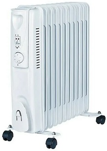
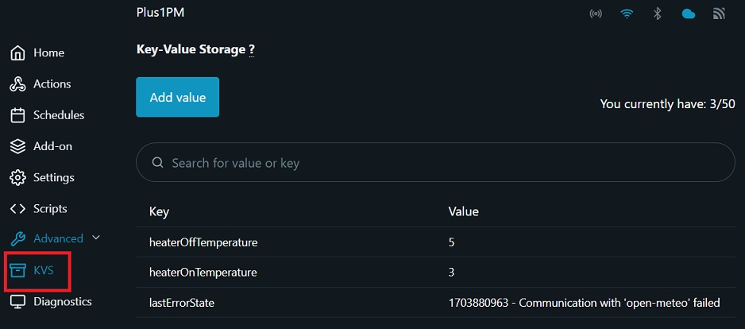

# Frost Guard Shield

If you have an unheated storage room or a small space at home where there is a risk of freezing, and you have been using a small radiator (Portable Electric Heater) to heat it until now, then this application is perfect for you.



Heaters like these and similar ones seem tailor-made for addressing the issue of freezing. In the fall, when external temperatures drop, you connect it to the power grid, and in the spring, when it warms up, you disconnect it. The heater is equipped with a built-in thermostat that you set according to your preference, and then you can forget about it as it operates automatically.

You're content with the solution until you connect it through a Shelly device and monitor its power consumption. You quickly realize that it's a real energy thief.

What can we do in this situation, considering the radiator is already connected through a Shelly device? The best approach is to use the Shelly to turn on the radiator only when necessary and turn it off when it's no longer needed.

You can purchase an additional temperature sensor or utilize a cloud service with weather forecasting to control the radiator based on the data obtained. The latter option seems to be the cheapest, at least in the short term, and here is my solution based on it.

## Configuration

Configuration design is based on following Shelly:

| Device view | Description |
|:---:|:---|
| |The entire range of Shelly devices can be used for this functionality. Ensure that a built-in relay output is present and that they are powerful enough to switch on/off your heater. It is important to choose a 2nd generation device that allows programming with JavaScript. This device will be used for turning the heater on and off.|

##	Description

The application periodically reads external temperature data from the cloud service https://open-meteo.com/ at a specified time interval. It then uses the obtained external temperature value to control the activation and deactivation of the heater.

Since the lower and upper temperatures depend on local characteristics, a bit of experimentation is required with the activation and deactivation temperatures. To avoid changing parameters within the application, their configuration is intended through the KVM (Key-Value Storage) interface available in the web interface of the Shelly module (see the image below). Upon the initial startup, the parameters will automatically be entered into the KVS.

Any errors that occur in the application are also logged in the KVS interface, along with the UTC time of their occurrence. The UTC decoder can be found at https://www.unixtimestamp.com/. It is advisable to promptly delete any errors from the KVS interface. When modifying parameters, it is important to be careful to enter them correctly, as an error could potentially disrupt operation. Errors typically occur during each regulation execution period, as defined in the temperatureControlInterval variable.



On selected Shelly, install the software located in the file: `frost-guard-shield.js`

[More detailed instructions how to install the software can be found on the manufacturer's website.](https://shelly-api-docs.shelly.cloud/gen2/Scripts/Tutorial)

Prior to use, configure the following parameters within the software's CONFIGURATION section:

|Variable setings|Description|
|:---|:---|
|url|see description below|
|heatOnTemperature|External temperature at which the heater will turn on. My choice is 5 degrees Celsius. This parameter will be automatically entered into the KVS at first start.|
|heatOffTemperature|External temperature at which the heater will turn off. My choice is 8 degrees Celsius. Leave a few degrees for hysteresis between the two temperatures to prevent constant switching on and off. This parameter will be automatically entered into the KVS at first start.|
|temperatureControlInterval|This is the interval (in minutes) during which the application checks the external temperature. I have it set to one hour, but it can also be much longer. Nothing happens here for several hours.|

We obtain the URL address on the website **https://open-meteo.com/**. The application requires our geographical data; we obtain **latitude** and **longitude** by clicking on the desired location on the **www.google.com/maps** page.

On page **https://open-meteo.com/**:
- first select the **Forecast API** option
- enter the data: **latitude**, **longitude**, and select the **timezone**.
- in the **Current Weather** section, select "Temperature (2 m)," and leave everything else unselected
Lower on the same page, in the **API Response** section, you will find the URL that we need; you can also test it immediately. The API response should look like this:

```
{
"latitude": 52.52,
"longitude": 13.419998,
"generationtime_ms": 0.015020370483398438,
"utc_offset_seconds": 0,
"timezone": "GMT",
"timezone_abbreviation": "GMT",
"elevation": 38,
"current_units": {
"time": "iso8601",
"interval": "seconds",
"temperature_2m": "°C"
},
"current": {
"time": "2023-12-28T22:15",
"interval": 900,
"temperature_2m": 7.4
}
}
```


