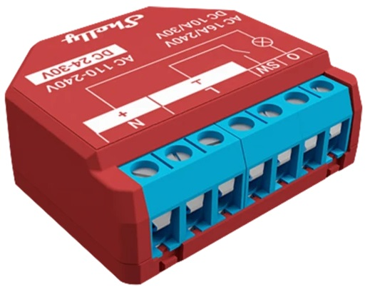

# Temporary Powering Down of Loads to Prevent Spikes

The goal is to avoid overloading the electrical power supply. Load shedding is a process where specific devices are disconnected during an overload until the overall network load decreases and there is enough capacity to reconnect them back again.

To achieve this, it is recommended to use electric devices that can tolerate occasional shutdowns without negative consequences. Examples include water heaters and electric heaters. On the other hand, devices that could cause inconvenience, like electric ovens, cooktops, and appliances with built-in sequential controllers (e.g., washing machines and dishwashers), are less suitable for this purpose.

The algorithm calculation is based on the energy consumption of the previous minute.

## Configuration

Configuration design is based on following Shelly devices:

| Device view | Description |
|:---:|:---|
| |**Shelly EM** is designed for measuring electrical energy. Must be installed in the main distribution panel on the supply line from the distribution. The installation is simple, as the device features a current transformer that clamps onto the supply conductor. My system is single-phase, if you have a three-phase system you need to use another device and software needs to be slightly modified.|
| |**Shelly Plus 1PM** or a similar device with a built-in smart relay and power metering. This device it is used for Load Shedding. We connect to it a device that shall be switched off in case of network overload. There's nothing to stop us using more devices with different settings to be more flexible.|

##	Description

**Shelly EM** is Gen 1 device so no software is foreseen in this device. Nevertheless, you can retrieve real-time power consumption and energy usage data from this device. When installing the Shelly EM device, it is important to set a fixed IP address. This ensures that other devices can always locate it and access its data when needed.

On the **Shelly Plus 1PM** device, install the software located in the file: `load-shedding.js`

[More detailed instructions how to install the software can be found on the manufacturer's website.](https://shelly-api-docs.shelly.cloud/gen2/Scripts/Tutorial)

Prior to use, configure the following parameters within the software's CONFIGURATION section:

|Variable name|Description|
|:---|:---|
|shellyEnergyMeterIP|IP address of Shelly EM device. As mentioned above IP must be fixed|
|loadSheddingPower|This value is compared with measurements from Shelly EM, if it is exceeded, the device will be disconnected.|
|switchBackPower|This value is compared with measurements from Shelly EM, if the consumption falls below this, the device will be switched on again.|
|minPowerToEnableLoadShedding|This is the power measured by the Shelly Plus 1PM, used to determine whether the device is actually powered on. As an example, the thermostat automatically switches off the water heater upon reaching the desired temperature. Even though the Shelly relay module is in the 'on' state, there is no power consumption. In such cases, it is unnecessary to turn off the heater, as there is no benefit.|

My settings example is as follows:

|Variable setings|Description|
|:---|:---|
|shellyEnergyMeterIP = "192.168.0.28";|After running the script, the console will display an HTTP address that can be used to verify if this part of the parameters is correctly configured|
|loadSheddingPower = 3500;            |My network consumption limit is 3.5 kW. If I exceed this limit during a 15-minute interval, I am subject to a penalty|
|switchBackPower = 100;               |100 W is my minimum consumption threshold when no major devices are in use (check with Shelly app.)|
|minPowerToEnableLoadShedding = 1000; |nothing special, 1kW is half of water heater power|

>**Warning**
>
>Be cautious to prevent "pumping"; the difference between the variables loadSheddingPower and switchBackPower should be greater than the power rating of the device being switched off. Otherwise, upon reconnecting the device, it may once again result in an overload, necessitating the need to turn it off again ... and so on.
