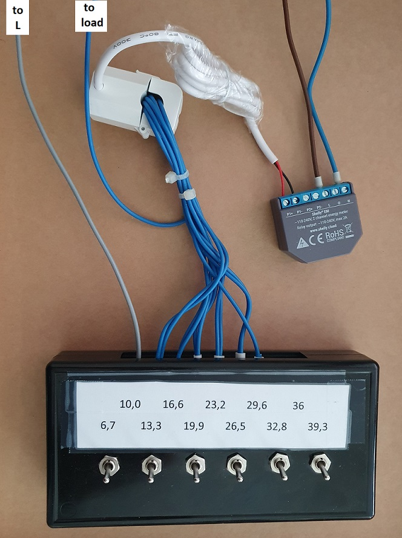

# Load Simulator for Shelly EM

In this simulator, we exploit the method by which Shelly EM captures current measurements. For this purpose, it utilizes a split-core current transformer.

Typically, this transformer encircles a single conductor, but by creating two turns around the core of the transformer, the current is doubled.

Multiple turns can be wound around the core of the measuring transformer, and these turns can be selectively switched on and off using switches. In this way, we simulate different currents to Shelly EM.

Below is a picture of my simulator:

>**Note:**
>
>The values written on the white sheet refer to a typical LED bulb with a power of approximately 6.7 W. It is clearly visible how power multiplies with the number of turns.
>
>If you encounter strange limit values in any script, now you know why.