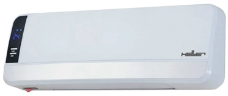
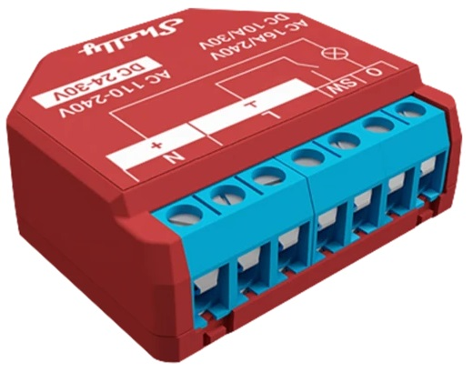
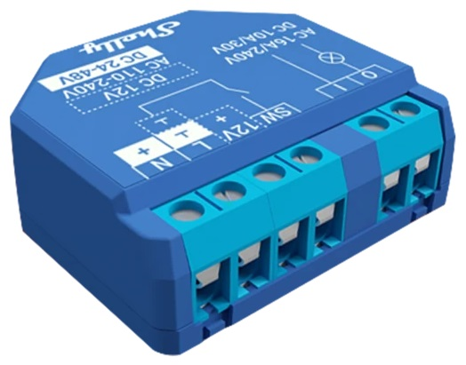
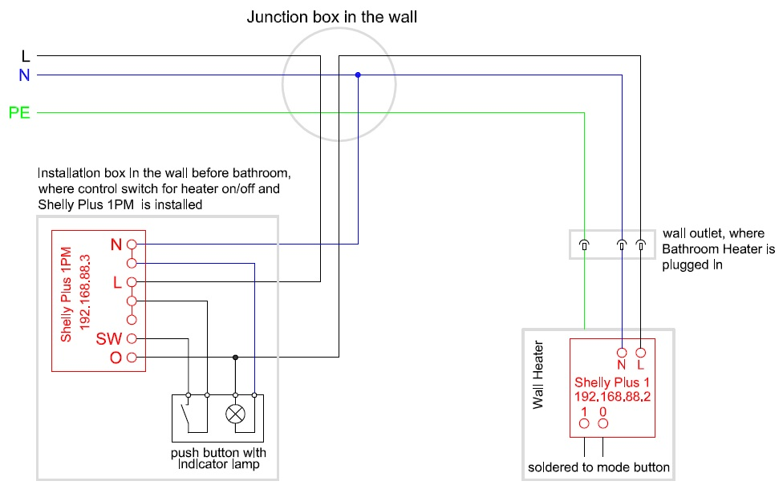
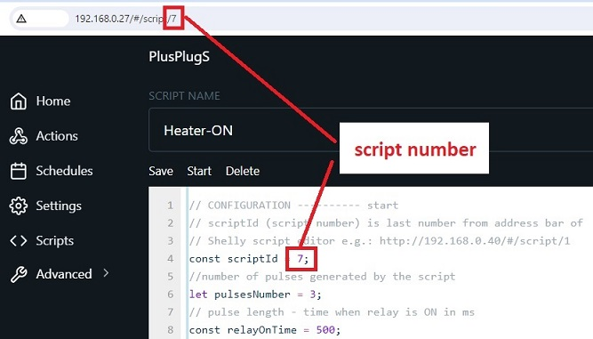
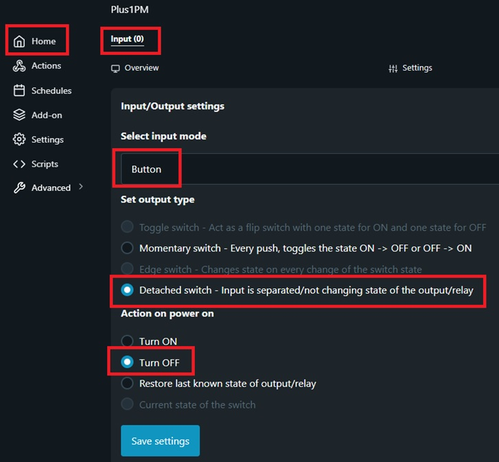

# Control and Monitoring of the Bathroom Heater

The image below illustrates a typical example of a bathroom electric heater that can only be controlled via a remote control. Although it has some function buttons on the front panel, these are not accessible to all family members due to the elevated installation height.

Remote control for a bathroom heater lacks practicality for several reasons, including the potential risk of water damage to the electronic components and the inconvenience of having to locate and use a remote in a bathroom setting, where simplicity and immediate control are more essential.
I prefer a traditional switch outside the bathroom to manually turn the heater on and off, providing a more straightforward and reliable control method.

The next issue is the automatic shutoff feature for the heater in case a user forgets to turn it off. Although this is typically included in the heater's original automation, it becomes impractical due to long time intervals. Additionally, the settings are reset in case of a power outage.
All these shortcomings led me to upgrade the heater, enabling manual control through a traditional switch outside the bathroom and incorporating an automatic shutoff feature for added convenience in case of forgetfulness.

These modifications achieved two objectives:

- reducing energy consumption due to forgetfulness and
- simplifying usage.

Furthermore, the device retains its original functionality and can still be operated in the initially intended manner.

## Configuration

Configuration design is based on following Shelly devices:

| Device view | Description |
|:---:|:---|
| |**Shelly Plus 1PM** or a similar device with a built-in smart relay and power metering. This device is utilized for powering on and off the Bathroom Heater, offering two options: either completely disconnecting the heater by cutting off the power or leaving the heater under supply (mostly in standby mode). Additionally, a switch for toggling the heater on and off outside the bathroom is connected to this device.|
| |**Shelly Plus 1** is selected because it is crucial to choose a device with a potential-free relay output, as this output is directly connected to the control electronics of the heater. The device is installed directly into the heater, simulating a press on the heater's control button. Although this may void your warranty, the associated benefits are considered well worth the trade-off. The relay output is soldered in parallel to the "Mode selection" button of the heater. Shelly module is powered directly from the power terminals inside the heater."|

The entire system schematic is shown in the image below. Some modifications to the house installation and to the wall heater are required. If you are not sufficiently qualified, it is advisable to delegate this task to a professional electrician.

|

##	Description

We have two Shelly devices:

**Shelly Plus 1PM**:

- its input is connected to the power button for turning the heater on and off, and
- its output supervises and controls the heater, indirectly interfacing with the Shelly Plus 1

The button connected to Shelly Plus 1PM has two functions:

- **Long press of the button**: Turns the heater's power on or off. This way, we can completely turn off the heater seasonally to reduce standby losses on the heater and Shelly Plus 1.
- **Short press of the button**: (meaningful only when the output of Shelly Plus 1PM is on) triggers one of the scripts on Shelly Plus 1. Depending on the measured power consumption state and the parameters 'powerWhenHeaterON' and 'powerWhenHeaterOFF', the algorithm decides whether to start or stop the heater.

If we forget to stop the heater within the prescribed time (autoStopHeaterTime setting), it stops automatically.

We utilize **Shelly Plus 1** to simulate keystrokes on the "Mode selection" button, enabling us to toggle between the following modes in the Bathroom wall heater (by toggling around):

- Stand-by - initial mode after power on
- Fan without heating 
- Heating on half power
- Heating on full power
- Heating on full power with swing
- Stop by entering standby (the fan stops 30 seconds after standby is activated).

Knowing the above sequence of states is crucial for determining the number of pulses needed to transition from one state to another. To transition from "Stand-by" to "Heating on full power", 3 pulses are needed, and to revert from operation back to "Stand-by", 2 pulses are required.

On the **Shelly Plus 1** device, install two times (two separate scripts) the software located in the file: `wallHeater-slave.js`

While it may sound unusual to install the same software on the device twice, it is necessary because different functionalities are achieved through parameter settings. One script will be responsible for turning on the heater, while the other will handle the shutdown process. For easier referencing, name one script 'Heater-ON' and the other 'Heater-OFF'.

[More detailed instructions how to install the software can be found on the manufacturer's website.](https://shelly-api-docs.shelly.cloud/gen2/Scripts/Tutorial)

Prior to use, configure the following parameters within the software's CONFIGURATION section:

|Variable name|Description|
|:---|:---|
|scriptId|Script number is last number from address bar when script editor is open (see picture below).|
|pulsesNumber|Number of pulses generated by the script, needed for transition from one state to another. Set the following values: in script Heater-ON (3), in script Heater-OFF (2) - see explanation above.|
|relayOnTime|Relay pulse length, time when relay is ON in ms. Special setting is not required, it can remain default.|
|relayOffTime|Relay pause length, time when relay is OFF in ms. Special setting is not required, it can remain default.|

The main conductor of the system is the **Shelly Plus 1PM**, installed next to the heater's power button outside the bathroom. On the **Shelly Plus 1PM** device, install the software located in the file: `wallHeater-master.js`

At the input of **Shelly Plus 1PM**, a button is connected (note that it must be a button, not a switch). A button is sufficient because Shelly determines whether the heater is on or off based on its power consumption. Therefore:

- a short press on the button with high power consumption turns off the heater, while
- a short press with low power consumption turns on the heater.

**Shelly Plus 1PM** controls the heater by remotely triggering the **Heater-ON** or **Heater-OFF** script on Shelly Plus 1 (as described above).

Prior to use, configure the following parameters within the software's CONFIGURATION section of **Shelly Plus 1PM** script:

|Variable name|Description|
|:---|:---|
|shellySlaveIP|IP address of Shelly Slave device (Shelly Plus 1). Shelly Plus 1 must have fixed IP address|
|scriptNumberForON|Script number to turn on the heater in Shelly Plus 1 device - same as in Heater-ON script|
|scriptNumberForOFF|Script number to turn off the heater in Shelly Plus 1 device - same as in Heater-OFF script|
|powerWhenHeaterON|The power at which the heater is considered to be ON. Check with Shelly app. My setting is: 1500 (1,5 kW) |
|powerWhenHeaterOFF|The power at which the heater is considered to be OFF Check with Shelly app. My setting is: 100 (100W) |
|autoStopHeaterTime|Setting the time for automatic heater shutdown. My setting is half an hour: 30 * 60 * 1000 |

The parameter settings on the Shelly Plus 1PM are also required, see the image below. The button must be disconnected, and personally, I prefer that nothing automatically turns on after a power outage.

>**Warning**
>
>It is essential to adhere to all regulations, standards, and guidelines when implementing electrical installations.
